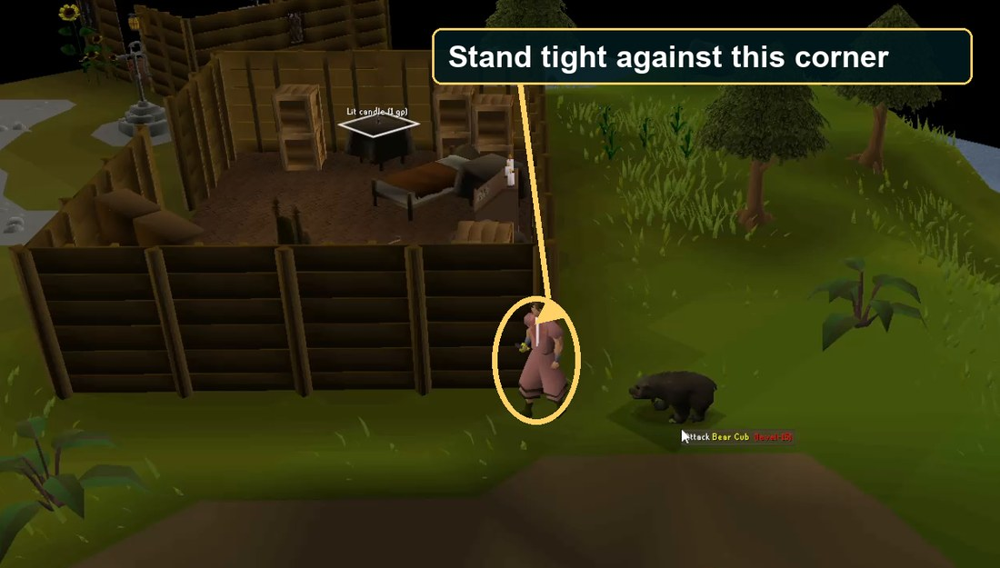

# Boardlocked

Boardlocked is a progression mode for the Old School RuneScape
[Chunk Picker V2](https://github.com/source-chunk/chunk-picker-v2). Instead of completing
every possible task in a chunk, a run advances one visit at a time through reachable
chunks, equipment upgrades, and skill progression.

## Play

Open:

**[https://navigatelabs.github.io/boardlocked/](https://navigatelabs.github.io/boardlocked/)**

Use the task icon in the top-right to reopen the panel.

## How Boardlocked plays

- Roll from the first reachable new tile or unfinished task tile in each direction.
- Cross taskless `FREE` tiles automatically while building the roll pool.
- Complete any one task offered for the current tile before rolling again.
- Recalculate routes when a completed task unlocks an item, level, or connection;
  a `FREE` tile becomes a task encounter as soon as it has an available task.
- Never put the tile you are standing on into the roll pool. Extra tasks there can
  be completed incidentally or rolled after you leave and reach it again.
- Keep skill tasks moving forward through a window tuned for each skill. Woodcutting
  uses +15, so a level-60 yew task needs a completed level-45-or-higher milestone.
- Score obtainable weapons separately for damage, melee defence, magic defence, and the other displayed combat roles. The label says which role makes an item an upgrade or tied current BiS.
- Prefer a specific obtainable item over a broader wear or wield task that it completes. Equipment BiS tasks explicitly require wielding or wearing the item, so finishing one also completes the matching metal or armour milestone.
- Import old runs while recalculating goals against the current rules and task data.

## Start a new account

Open a fresh run and choose your start options before the first roll. The default
pool excludes Morytania, the desert,
Prifddinas, quest-locked islands, damaging environments, guild interiors, and
other poor level-3 starts.

**Druidic Ritual is recommended and enabled by default.** Complete this setup
before your first roll:

1. Pick up the iron dagger near Lumbridge.
2. Kill a level 3 rat in Lumbridge Swamp for raw rat meat. Avoid the level 6 rat.
3. Buy raw chicken and raw beef from Wydin's Food Store in Port Sarim.
4. Ask Veos for Kourend, then take his boat to Land's End.
5. Flinch the bear cub beside the ruined house, take its meat, and finish Druidic Ritual.



Attack once, return to the marked corner, and wait for the bear's health bar to
disappear. Repeat until it dies.

Three optional start groups are available before the first roll:

- **Varlamore:** adds the released continent and assumes you completed Children of the Sun before rolling. Starts stay on the connected overworld surface, outside Tempestus and quest-only interiors.
- **Wilderness:** adds a small set of shallow, low-risk tiles. PvP risk still applies.
- **Ocean starts (experimental):** adds an equal-chance group of beginner waters near Port Sarim to the first roll, assumes you completed Pandemonium, and starts Sailing at level 5 from its 400 XP reward. Land remains a possible result while other groups are enabled. This option does not disable later sea access through normal map connections. Ocean starts are still largely untested.

Each enabled group has the same chance to be selected, then every tile within that
group has the same chance. If a tile is split into disconnected areas, one matching
land or water area is then chosen at random; extra areas do not make that tile more
likely to win. The map highlights the exact chosen area in gold and lists the exits
available from it. The result also says `LAND`, `WATER`, or `MIXED`.
Later rolls retain the exact connected sections: land never grants water access,
water never grants land access, and both open only when both have real connections.

## Protect your save

Boardlocked saves automatically in this browser and keeps the previous valid save
as a recovery copy. Site updates migrate older saves automatically; they do not
reset chunks, completions, levels, equipment, or visit history.

Browser storage is still local. **Clearing cookies/site data, resetting the browser,
or moving to another browser or device can delete it.** Use **Download backup** in
the run panel regularly and keep the JSON file outside the browser. **Import backup**
restores old Boardlocked exports as well as the current format.

## Run locally

Opening `index.html` directly will not work because browsers restrict JSON requests
and Web Workers on `file://` pages. Serve the repository over HTTP instead:

```powershell
cd C:\chunk-picker-v2
node scripts/serveLocal.js
```

Then open **http://127.0.0.1:8080/?local=default**.

No package installation or build step is required. The site still loads several
public libraries from CDNs, so an internet connection is needed.


## Credits

Boardlocked is based on [source-chunk/chunk-picker-v2](https://github.com/source-chunk/chunk-picker-v2),
the Chunk Picker website for the fan-made One Chunk Man mode. Thanks to the original
Chunk Picker contributors and to [Alyx Bailey](https://www.youtube.com/c/AlyxBailey)
for creating the mode!
